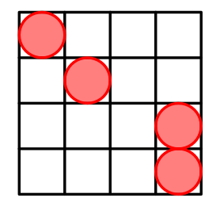
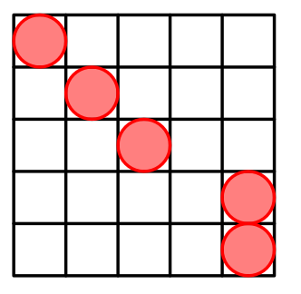

# 1961 ~ 1970
## [1965. Codeforces Round 941 (Div. 1)](https://codeforces.com/contest/1965)

### [C. Folding Strip](https://codeforces.com/contest/1965/problem/C)

**Solution:**

Good problem.

**Statement: If two adjacent numbers are equal, then we are supposed to fold it.**

[Proof](https://codeforces.com/blog/entry/128914)

The final answer must be `010101010101...` or `1010101010...`

Put the beginning of the string at the position $0$, then simulate the folding procession and write down the maximum and minimum position.

The answer is `maximum - minimum + 1`.

## [1967. Codeforces Round 942 (Div. 1)](https://codeforces.com/contest/1967)

### [C. Fenwick Tree](https://codeforces.com/contest/1967/problem/C)

**Solution:**

Once f function can convert $\{a_i\}$ into $\{c_i\}$.($c_i$ is the fenwick tree array of $a_i$)

For a position u, we should figure out which positions it contributes to.

In the fenwick tree, if v is d-th ancestor of u, then $b_u$ can contribute to $b_v$. 

The number of contribution which u dose to v is $\binom{d + k - 1}{k - 1} \times b_u$, cause every option we can go forward any steps (even $0$).
So $b_v$ should minus $\binom{d + k - 1}{k - 1} \times b_u$.

For every position, $b_i$ minus all the number other positions contribute to before should be the answer.

## [1968. Codeforces Round 943 (Div. 3)](https://codeforces.com/contest/1968)

### [E. Cells Arrangement](https://codeforces.com/contest/1968/problem/E)

**Solution:**

For $n \le 3$, we can easily find the answer.

And for $n = 4$, the answer is:

    
for $n = 4$, the answer is:

So we can generate the following patterns by putting cells at the top left position. 
  
