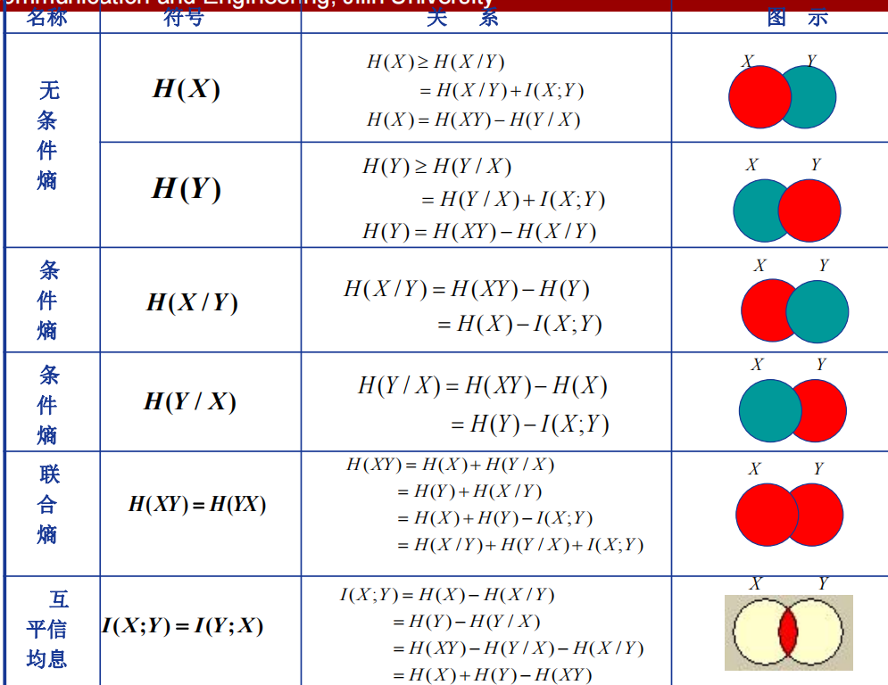

# 信道和信道容量

## 信道的数学模型和分类

根据信道转移概率 $p(y|x)$ 可将离散信道分成三种

- 无干扰（无噪）信道：无噪声，也无码间干扰。信道的输出符号 $Y$ 和输入符号 $X$ 之间有确定的一一对应关系。
- 有干扰无记忆信道特点：输出符号 $Y$ 和输入符号 $X$ 之间无确定的对应关系。
- 有干扰有记忆信道：某一时刻输出符号对应于此时刻的输入符号，而且还与前些时刻的输入、输出符号有关。

!!! note "离散无记忆信道的充要条件"
    $$
        p(y/x) = \prod_{i = 1}^N p(y_i/x_i)
    $$

二进制离散信道模型由一个允许输入值的集合 $X＝{0,1}$ 和可能输出值的集合 $Y={0,1}$，以及一组表示输入、输出关系的条件概率（转移概率）组成。

\begin{align}
p(a_ib_j) = p(a_i)p(b_j/a_i) \\
p(b_j) = \sum_{i = 1}^r p(a_i)p(b_j/a_i)
\end{align}

其中 $p(a_i)$ 是先验概率，$p(b_j/a_i)$ 是信道传递概率，$p(a_i/b_j)$ 是后验概率。

## 信道疑义度及平均互信息

### 信道疑义度

信道输入信源 $X$ 的熵（先验熵）：表示在接收到 $Y$ 以前关于输入变量 $X$ 的先验不确定性的度量。

$$
    H(x) = -\sum_x p(x)\log p(x)
$$

收到后关于的平均不确定性为（后验熵） 

$$
    H(x / b_j) = -\sum_x p(x / b_j)\log p(x / b_j)
$$

收到 $Y$ 的全部符号后关于 $X$ 的不确定性，表示传输过程中失去的熵值（少得到的信息量），又称为信道疑义度/损失熵：

\begin{align}
    H(X / Y) &= -\sum_j p(b_j)H(X / b_j) \\
             &= -\sum_{X, Y} p(xy)\log p(x / y)
\end{align}

当损失熵 $H(X|Y)=0$ 时，信道上传送的信息量正是输入信号的全部信息量。

当 $X$ 和 $Y$ 统计独立时，接收的 $Y$ 完全与发送的 $X$ 无关，此时 $H(X|Y)=H(X)$，说明损失的信息达到与输入符号信息熵相等的程度。即信道上没能传送任何信息。

### 平均互信息

统计平均地看：输出端每收到一个符号，对信源 $X$ 解除了多少不定度就获得了多少信息量，这就是平均互信息 $I(X;Y)$ 的概念。

$$ 
    I(X;Y) = \sum_{X, Y}p(xy)\log \dfrac{p(xy)}{p(x)p(y)} = \sum_{X, Y}p(x)p(y/x)\log \dfrac{p(y/x)}{p(y)}
$$

互信息 $I(x;y)$：代表收到某消息 $x$ 后获得关于某事件 $y$ 的信息量。

$$ 
    I(x;y) = \log \dfrac{p(xy)}{p(x)p(y)} = \log \dfrac{p(y/x)}{p(y)}
$$

!!! note "$I(X;Y)$ 和 $I(x;y)$ 的区别"
    $I(X;Y) = E[I(x;y)]$

    互信息可以为负，平均互信息非负。

## 平均互信息的特征

- 非负性。该性质说明：离散信源通过有噪声信道传输，接收端总会获取到关于信源的信息量，除非输入输出是统计独立的。
- 极值性。在有噪声信道中，信道疑义度总大于零。
- 对称性（交互性）。
- 凸函数性
    对于固定信道：$I(X;Y)$ 是输入信源的概率 $p(x)$ 的上凸函数。
    - 意义：对于某一个固定信道，一定存在一种信源使输出端获得的平均信息量最大（存在极大值），即对于每种信道都存在一种最好的信源。
    对于固定信源：$I(X;Y)$ 是信道传递概率的概率 $p(y/x)$ 的下凸函数。
    - 说明：对每一种信源都存在一种最差的信道，此信道的干扰（噪声）最大，使输出端获得的信息量最小。

从通信系统角度看熵的意义

- $H(X)$：表示信源侧每个符号的平均信息量（信源熵）。
- $H(Y)$：表示信宿侧每个符号的平均信息量（信宿熵）。
- $H(X|Y)$：信道疑义度（含糊度），表示在输出端接收到 $Y$ 后，发送端 $X$ 尚存的平均不确定性，通常称为损失熵。
- $H(Y|X)$：信道散布度，表示在已知 $X$ 后，对于输出 $Y$ 尚存的平均不确定性，通常称为噪声熵。
- $H(XY)$：表示整个信息传输系统的平均不确定性。

## 离散信道的信道容量

信息传输率

$$
    R = I(X;Y) = H(X) - H(X/Y) 
$$

信息传输速率：单位时间内平均传输的信息量。单位：bps。

$$
    R_t = I(X;Y) = H(X) - H(X/Y) 
$$

信道容量

- 最大信息传输率

$$
    C = \max_{p(x)} [I(X;Y)] 
$$

- 最大信息传输速率

$$
    C_t = \dfrac{1}{t}C = \dfrac{1}{t}\max_{p(x)} [I(X;Y)]  
$$

离散信道达到信道容量时的输入概率分布**不是**唯一的、输出概率分布**是**唯一的。

**对称离散信道的信道容量**

$$
    C = \log S - H(p_1', p_2',..., p_s')
$$

当输入符号是等概的时候才能达到该最大值。

**强对称信道的信道容量**

$$
    C = \log r - p\log(r - 1) - H(p, \bar p)
$$

当 $r = 2$ 时，$C = 1 - H(p, \bar p)$。

**准对称信道**

$$
    C = \log r - H(p_1', p_2',..., p_s') - \sum_{k = 1}N_k\log M_k
$$

其中 $N_k$ 是第 $k$ 个子矩阵中行元素之和，$M_k$ 是第 $k$ 个子矩阵中列元素之和。

!!! warning
    注意信道公式中一个是 $\log s$，一个是 $\log r$。

## 离散无记忆扩展信道的信道容量

## 组合信道的信道容量

## 连续信道和波形信道的信道容量

连续信道的信道容量为 $C = \dfrac{1}{2}\log_2\left(1 + \dfrac{P_X}{P_N}\right)$

信道中加性高斯白噪声的均值为零，功率谱密度为 $\dfrac{n_0}{2}$，设信道带宽为 $B$，则 

$$
    C = BT\log_2 \left (1 + \dfrac{P_X}{N} \right ) = BT\log_2 \left (1 + \dfrac{P_X}{n_0B} \right )
$$

Shannon 公式

$$
    C_t = \lim_{T \to \infty} \dfrac{C}{T} = B\log_2 \left (1 + \dfrac{P_X}{N} \right )
$$

重要指导意义：

- 提高信噪功率比能增加信道的信道容量。
- 当噪声功率 $n_0 \to 0$ 时，$C_t \to \infty$（无干扰连续信道的信道容量为无穷大）。
- 当信道容量一定时，带宽、时间、信噪比可以互换。
- 当信道带宽 $B \to \infty$ 时，信道容量 $C_t$，趋于一个定值。极限传输速率 

$$
    \lim_{B \to \infty} C_t \approx 1.44 \dfrac{P_X}{n_0}
$$

> 结论：即使传输带宽无穷大，此时信道容量也是有限的，原因在于当 $B \to \infty$ 时，其噪声功率也趋于无穷大。

- 无错误通信的传输速率的理论极限

$$
    \lim_{B \to \infty} C_t \approx 1.44 \dfrac{P_X}{n_0}
$$

- 频带利用率与功率利用率的关系

> $\dfrac{E_b}{n_0}$：能噪比，反映了系统的功率利用率，即系统利用所发送信号功率的能力；能噪比越小，系统的功率利用率越高。

若想实现可靠通信，则要满足 $R_b \le C$。又因为 $P_X = R_bE_b$ 且 $R_b = B\log \left (1 + \dfrac{E_bR_b}{n_0B} \right )$，则有 $\dfrac{E_b}{n_0} > \dfrac{2^{\frac{R_b}{B} - 1}}{\frac{R_b}{B}}$。这里 $R_b$ 是传输速率，$B$ 是信道带宽。

> 1. 当能噪比较小时，频带利用率随能噪比的增大而增大。
> 2. 当能噪比较大时，频带利用率趋近于 $C/B$ ($C_t = C$)。

