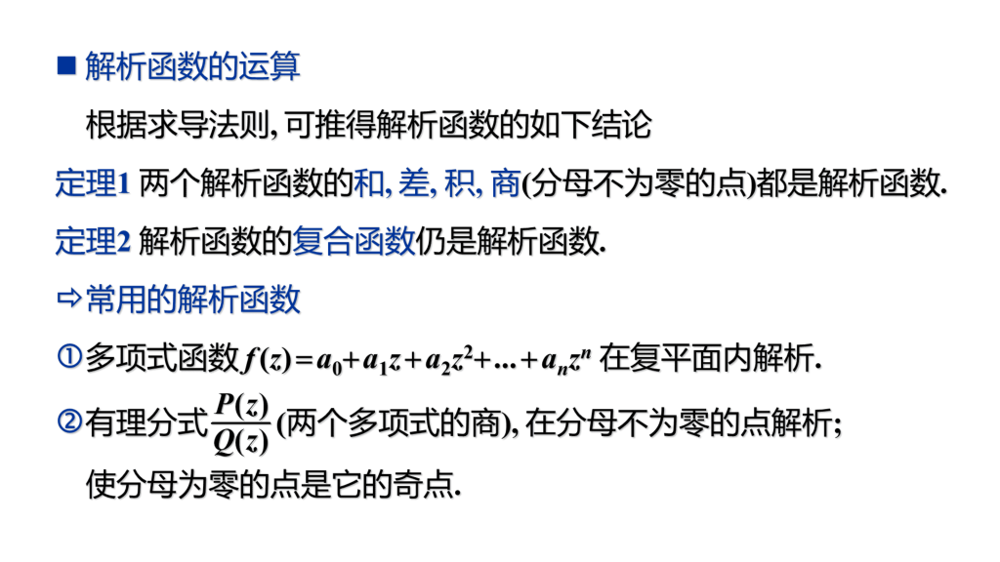
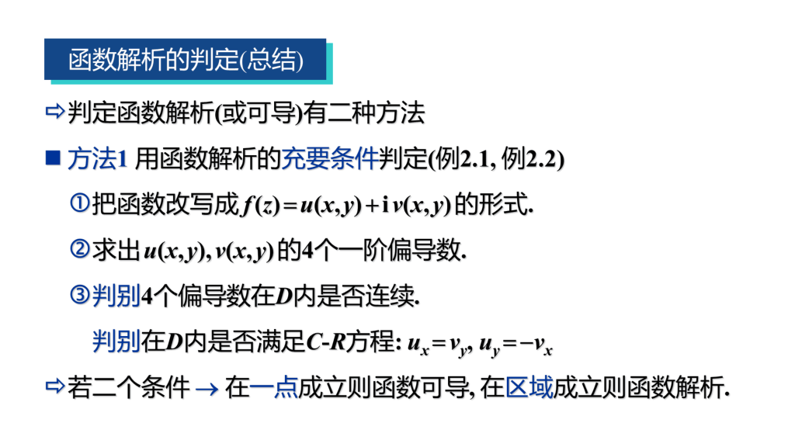
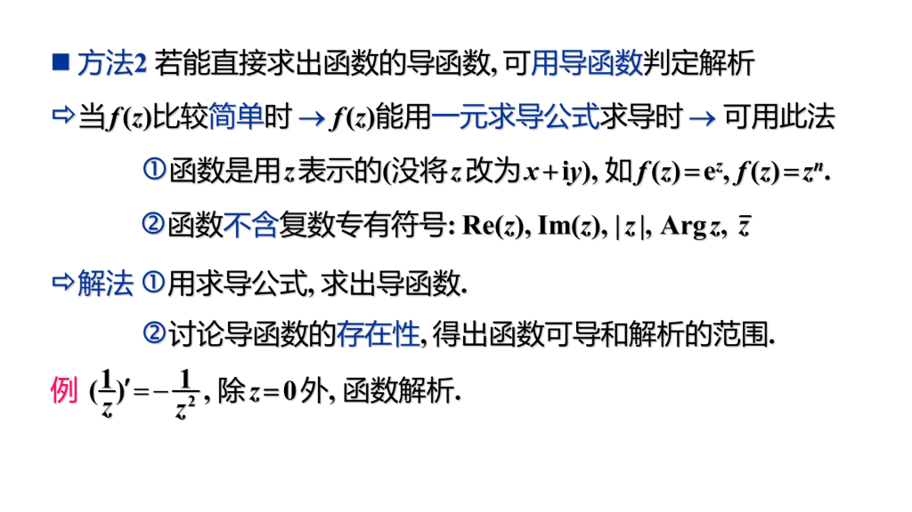
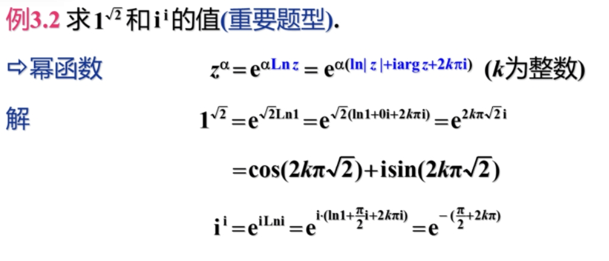

# 第二章 解析函数

## 0 总结

- [ ] 可导，可微的判别方法总结。

- 求导

  形如 $w = f(z)$ 的导数，与一元函数求导方法一样。

  形如 $f(z) = u(x, y) + iv(x, y)$ 的导数，求导公式为 $f'(z) = \dfrac{\partial u}{\partial x} + i\dfrac{\partial v}{\partial x} = \dfrac{\partial v}{\partial y} - i\dfrac{\partial u}{\partial y}$。

- 相关概念

  在某点解析：指的是在该点及邻域可导。

  奇点：函数不解析的点。

  解析函数：函数在某区域内处处可导。

  函数可导与解析的判定：先求出 $f(z) = u(x, y) + iv(x, y)$ 的偏导数，然后判定偏导数是否满足 $C-R$ 方程：$u_x = v_y, u_y = -v_x$。

  > 如果在某点推出成立，则函数在该点可导。如果某区域内成立，则在该区域内解析。

- 初等函数

  **指数函数**

  $w = e^z = e^xe^{iy} = e^x(\cos y + i\sin y)$

  基本上和实数情况一样，只是多了周期性。

  实数部分表示模长，虚数部分表示辐角。

  **对数函数**

  $Ln z = \ln |z| + i\arg z + 2k \pi i$

  对数函数是多值函数，其主值是 $\ln z = \ln|z| + 2i\arg z$。

  对数函数在**除去原点与负实轴的复平面**上连续且解析。

  对数函数的积商公式依然成立，但是对数函数的 $n$ 次方公式以及对数函数的开 $n$ 方根公式就不成立了（因为后面加上的 $2\pi i $ 的系数不同）。

  **幂函数**

  $w = z^{\alpha} = e^{\alpha Ln z} = e^{\alpha(\ln |z| + i\arg z + 2k\pi i)} = e^{\alpha(\ln |z| + i\arg z)}e^{2k\alpha \pi i}$

  当 $\alpha$ 是整数时，幂函数是单值函数。而当不是整数时，函数是多值函数。

  当 $\alpha$ 不是整数时，幂函数在**除去原点与负实轴的复平面**上连续且解析。

  **三角函数**
  $$
  \sin z = \dfrac{e^{iz} - e^{-iz}}{2i}, \\
  \cos z = \dfrac{e^{iz} + e^{-iz}}{2}
  $$
  值得注意的是，复数域上三角函数**是无界的！**

  不过除了无界外，其他是一样的。

## 1 解析函数的概念

- 可导必连续，连续未必可导（同二元函数）

- 复变函数求导与**一元**实变函数相同

- 若 $w = f(z)$ 在 $z_0$ **及 $z_0$ 的领域内**处处可导，则称 $f(z)$ 在 $z_0$ 解析，$z_0$ 称为解析点。

    若 $f(z)$ 在区域 $D$ 内每一点都解析，则 $f(z)$ 是 $D$ 内的解析函数。

    若 $f(z)$ 在 $z_0$不解析，称 $z_0$ 为 $f(z)$ 的奇点。

    > 注意以下解析和求导的区别，可导要求某个点，解析要求的是某点及邻域。
    >
    > 在某点处，解析必可导，可导未必解析。
    >
    > 在某区域内，解析与可导等价。
    >
    > **在某区域内，判断解析性往往要靠求导去判断（若是看作一元函数，直接求导解决，若是看作二元函数，在证明不可解析时可以化作二元函数极限不存在来求）。**

## 2 函数解析的重要条件

- 函数 $f(z) = u(x, y) + iv(x, y)$ 在点 $z = x + iy$ 处可导的充要条件是：

    -  $u(x, y)$ 和 $v(x, y)$ 在 $(x, y)$ 可微
    - 在点 $(x, y)$ 满足**柯西-黎曼方程**：$\dfrac{\partial u}{\partial x} = \dfrac{\partial v}{\partial y},\dfrac{\partial u}{\partial y} = -\dfrac{\partial v}{\partial x}$

    > 关于可导和可微：在一元函数中，它们互为充要条件，在多元中可微是可导的必要条件，可导不一定可微。

- 由于在某一区域内，函数解析与可导等价，函数 $f(z) = u(x, y) + iv(x, y)$ 在区域 $D$ 内解析的充要条件是：

    -  $u(x, y)$ 和 $v(x, y)$ 在 $D$ 内可微
    - 满足**柯西-黎曼方程**：$\dfrac{\partial u}{\partial x} = \dfrac{\partial v}{\partial y},\dfrac{\partial u}{\partial y} = -\dfrac{\partial v}{\partial x}$

    > 值得一提的是，当满足该条件时，$f'(z) = \dfrac{\partial u}{\partial x} + i\dfrac{\partial v}{\partial x} = \dfrac{1}{i}\dfrac{\partial u}{\partial y} + \dfrac{\partial v}{\partial y}$

- 讨论函数解析性，需证明函数可微，主要有以下两种方法：
    - 用可微的定义：$\Delta u = A_1\Delta x + B_1\Delta y + o(\rho)$（较难，不推荐）。
    - 用可微的充分条件，判断 $u(x, y)$，$v(x, y)$ 的偏导数连续来证明可微。

## 3 初等函数

复变量的初等函数和实变量的基本相同，但**个别区别较大**。

- 指数函数

    $w = e^z = e^{x + iy} = e^x(\cos y + i\sin y)$，且满足原有的求导公式。

    注意区别的是 $w = e^z$ 是以 $2k\pi i$ 为周期的函数。

    指数函数在复平面内处处解析。

- 对数函数（区别较大）

    指数函数 $e^w = z$ 的反函数 $w = f(z)$ 称为对数函数，记作 $w = Ln z$。

    由 $e^{u + iv} = e^ue^{iv} = e^u(\cos v + i\sin v)$，我们有 $u = \ln|z|,v = \theta + 2k\pi = Arg z$。故 $Lnz = \ln|z| + iArgz = \ln|z| + i\arg z + 2k\pi i$。

    记 $\ln z = \ln|z| + i\arg z$ 为 $Lnz$ 的主值。对于给定不同的 $k$ 所形成的不同 $Lnz$ 称为其中一个分支。$\ln z$ 满足原有的求导公式。

    > **注意复数 $z$ 的模长只和实部 $u$ 有关。**

    此时对数函数的积商公式仍然成立 $Lnz_1z_2 = Lnz_1 + Lnz_2,Ln\dfrac{z_1}{z_2} = Lnz_1 - Lnz_2$。

    但是 $n$ 次幂和 $n$ 次方根的对数公式不再成立。

    > 由于 $Lnz^n = n\ln|z| + in\arg z + 2k_1\pi i$ 而 $nLnz = n\ln|z| + in\arg z + n2k_2\pi i$ 后面的 $2\pi i$ 的系数不同，故不相等。

    由于 $\ln|z|$ 除了原点外处处解析，而 $\arg z$ 在原点和负实轴上不连续，故对数函数的主值 $\ln z$ 在除去原点和负实轴的平面上连续，同理 $Ln z$ 的各个分支在除原点和负实轴的复平面上解析。

- 幂函数

    $w = z^n$ 是复平面内的单值解析函数，$w = z^{-n}$ 除原点外是单值解析函数（$n \in \N$）。

    $w = z^\alpha = e^{\alpha Lnz} = e^{\alpha(ln|z| + iargz)}e^{2k\alpha \pi i}$，不难发现如果 $\alpha$ 是整数，则 $w$ 必是单值函数，但 $\alpha$ 取小数时，$w$ 可能是多值函数。

    由于 $Lnz$ 的各分支在除去原点和负实轴的平面上是解析的，所以 $w = z^{\alpha}$ **的各分支**在除去原点和负实轴的平面上是解析的（**注意多值函数是不可解析的**）。

    幂函数的导数和之前相同。

- 三角函数

    由欧拉公式，易得 $\sin z = \dfrac{e^{iz} - e^{-iz}}{2i}$，$\cos z = \dfrac{e^{iz} + e^{-iz}}{2}$。

    以前学过的三角函数公式全都适用。

    **三角函数在复数域是无界函数。**

    $\sin z$ 是奇函数，$\cos z$ 是偶函数，且它们依然是以 $2\pi$ 为周期的。

    求导和之前相同，且在整个复平面上解析。

## 4 例题

