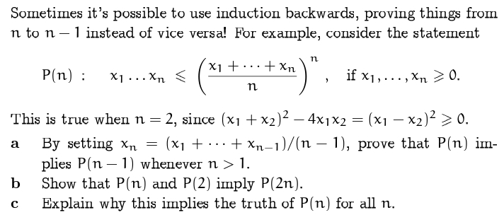
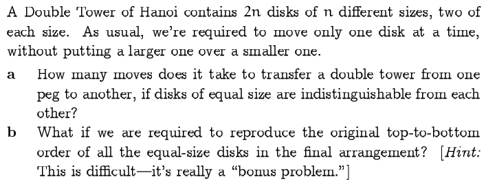

# Recurrent Problems

对于 n 条直线划分区域个数 $L_n$，满足 $L_n = L_{n - 1} + n = S_n + 1 = \dfrac{1}{2}n(n + 1) + 1$。
其中 $S_n$ 也被称为三角数。

对于 n 条折线划分区域个数 $Z_n$，可以看作是两条直线，然后每两条直线（即一个折线）切割的区域少了 2 个，满足 $Z_n = L_{2n} - 2n = 2n^2 - n + 1$。

### Exercise 8

!!! success "Solution"
    $Q_0 = \alpha, Q_1 = \beta, Q_2 = \dfrac{1 + \beta}{\alpha}, Q_3 = \dfrac{1 + \alpha + \beta}{\alpha\beta}, Q_4 = \dfrac{1 + \alpha}{\beta}, Q_5 = \alpha, Q_6 = \beta$

    呈周期变换。

### Exercise 9

!!! success "Solution"
    **a.** 把 $x_n = \dfrac{\sum x_{n - 1}}{n - 1}$ 代入公式即可推出。

    **b.** 
        \begin{eqnarray}
        (x_1x_2...x_n)(x_{n + 1}x_{n + 2}...x_{2n}) \le \left (\dfrac{x_1 + x_2 + ... + x_n}{n}\right )^n \left (\dfrac{x_{n + 1} + x_{n + 2} + ... + x_{2n}}{n}\right )^n \newline \le \left (\left (\dfrac{x_1 + x_2 + ... + x_n + x_{n + 1} + x_{n + 2} + ... + x_{2n}}{2n}\right )^2\right )^n
        \end{eqnarray}
        

    **c.** 所有的二的幂次都可以满足，然后小于二的幂次的也都能满足。

**Exercise 10** 

**Exercise 11** 

**Exercise 12** 

### Exercise 13

!!! success "Solution"  
    **先给出一个神秘结论：如果对于某种划分，新加入的线产生了 k 个交点，那么则会产生 k + 1 个新区域。
    这个结论对于直线，折线和本题均适用。**

    对于每个 zig-zag，我们可以用充分长的极狭窄的折线代替，这样对于每次新增的 zig-zag，它都会对之前另外某个 zig-zag 产生 9 个点，那么一共可以产生 9(n - 1) 个点，故可产生 9(n - 1) + 1 个新区域。则有 $ZZ_n = ZZ_{n - 1} + 9(n - 1) + 1 = 9S_n - 8n + 1 = \dfrac{9}{2}n^2 - \dfrac{7}{2}n + 1$。

**Exercise 14** 

**Exercise 15** 

**Exercise 16** 

**Exercise 17** 

**Exercise 18** 

**Exercise 19** 

**Exercise 20** 

**Exercise 21** 

